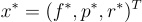

# Lyapunov_Control_Ecosystem
Lyapunov Control of Predator_Prey_Food Ecosystem

---

## Problem Description

We simulate and control a simplified ecosystem using a dynamical systems framework. The ecosystem consists of three interacting populations:

- **Food (F)**: A renewable resource.  
- **Prey (P)**: Herbivores that consume food.  
- **Predators (R)**: Carnivores that consume prey.  

Our objective is to control this system using feedback such that the state $(F, P, R)$ converges to a desired target equilibrium.

---

## State Space Description

The system's state is described by the vector:

$$
x = \begin{bmatrix} f \\ 
p \\ 
r \end{bmatrix}
$$

Where:
- $f$: amount of food,
- $p$: number of prey,
- $r$: number of predators.

---

## Action Space Description

The control action vector $u \in \mathbb{R}^3$ is defined as:

$$
a = \begin{bmatrix} a_1 \\ 
a_2 \\ 
a_3 \end{bmatrix}
$$

Where:
- $a_1$: control input to influence food supply,
- $a_2$: control input to influence prey population,
- $a_3$: control input to influence predator population.

---

## System Dynamics

The dynamics are modeled as a set of nonlinear differential equations:

$$
\begin{aligned}
\frac{df}{dt} &= kf - \alpha p + a_1 \\
\frac{dp}{dt} &= \beta fp - \gamma r + a_2 \\
\frac{dr}{dt} &= \delta pr - \mu r + a_3 \\
\end{aligned}
$$

Where:
- $k$: food influx rate,
- $\alpha$: rate of food consumption by prey,
- $\beta$: prey growth efficiency due to food,
- $\gamma$: predation rate,
- $\delta$: predator growth efficiency due to prey,
- $\mu$: predator death rate.

---

## Lyapunov-Based Control

To stabilize the system to a desired target state , we employ Lyapunov-based feedback control. The Lyapunov function is chosen as a quadratic energy function:

$$
V(x) = (x - x^*)^T Q (x - x^*)
$$

In our implementation, we use the **identity matrix** for $Q$, which simplifies the Lyapunov function to:

$$ V(x) = (f - f^*)^2 + (p - p^*)^2 + (r - r^*)^2 $$

---

### Properties of the Lyapunov Function

1. **Positive Semi-Definite**:  
   $$ V(x) \geq 0 \quad \forall x$$
   with equality if and only if $x = x^*$.

2. **Time Derivative of the Lyapunov Function**:

   Let $e = x - x^*$. Then the derivative is:

   $$\dot{V}(x) = 2(f - f^*)\dot{f} + 2(p - p^*)\dot{p} + 2(r - r^*)\dot{r}$$

   The controller is designed so that $\dot{V}(x) \leq 0$, which ensures stability and convergence to the equilibrium point.

---

## Controller and Class Structure

The system is implemented using a modular, class-based structure with clear responsibilities:

--- fix mistakes
